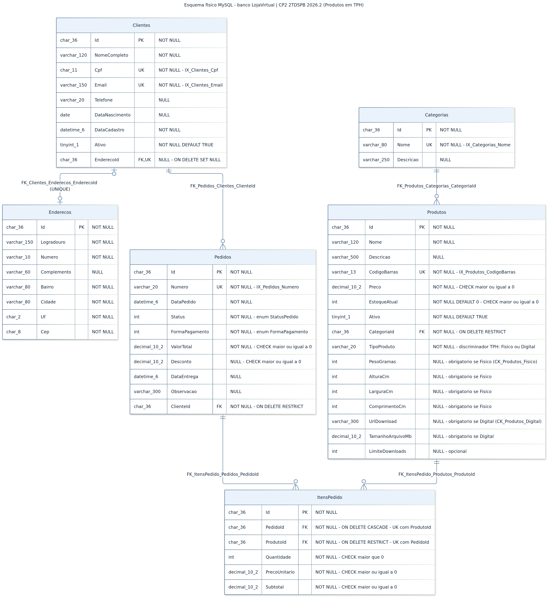
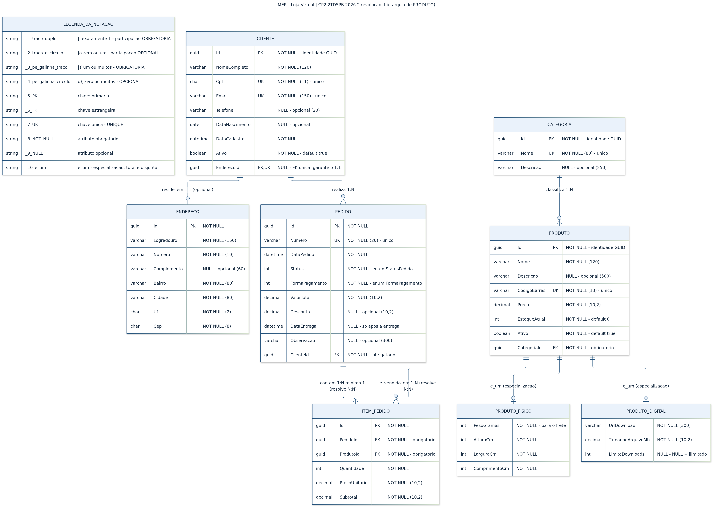

# CP2 — 2TDSPB 2026.2 · Persistência com EF Core, Mapeamento e Infraestrutura

Continuação do CP1: o MER da **Loja Virtual** agora é persistido em **MySQL** (Docker) com
**Entity Framework Core 9**, mapeamento via **Fluent API**, **migration** versionada,
herança **TPH** e **repositório genérico** registrado por injeção de dependência, tudo dentro da
**Clean Architecture** montada no CP1.

## Integrantes

| Nome | RM |
|---|---|
| Murilo Marques Cabral | 568224 |
| Paulo Henrique Da Silva Kian | 563343 |
| Matheus Carneiro Maciel | 567753 |

## Domínio: Loja Virtual (resumo do CP1)

Uma loja que vende produtos pela internet. O **cliente** se cadastra e pode informar um
**endereço** de entrega; os **produtos** são organizados em **categorias**; o cliente fecha um
**pedido**, cujos **itens** registram quais produtos foram comprados, em que quantidade e por
qual preço. No CP2, o produto passou a ser **físico** (entregue por transportadora) ou
**digital** (entregue por download).

| Relacionamento | Tipo | Opcionalidade |
|---|---|---|
| Cliente ⟷ Endereco | **1:1** | Cliente tem 0 ou 1 endereço (`EnderecoId` nullable + UNIQUE) |
| Cliente → Pedido | **1:N** | Pedido tem exatamente 1 cliente |
| Categoria → Produto | **1:N** | Produto tem exatamente 1 categoria |
| Pedido → ItemPedido | **1:N** | Pedido tem 1 ou muitos itens |
| Produto → ItemPedido | **1:N** | Produto aparece em 0 ou muitos itens |
| Pedido × Produto | **N:N** | Resolvido pela entidade associativa `ItemPedido` |
| Produto ⇐ ProdutoFisico / ProdutoDigital | **Herança (TPH)** | Todo produto é exatamente um dos dois |

| MER | Arquivo |
|---|---|
| MER do CP1 (entregue no CP1, sem alteração) | [`docs/mer.png`](docs/mer.png) · fonte [`docs/mer.mmd`](docs/mer.mmd) |
| **MER atualizado no CP2** (com a hierarquia de Produto) | [`docs/mer-cp2.png`](docs/mer-cp2.png) · fonte [`docs/mer-cp2.mmd`](docs/mer-cp2.mmd) |
| **Esquema físico no MySQL** | [`docs/esquema-fisico.png`](docs/esquema-fisico.png) · SQL [`docs/esquema-fisico.sql`](docs/esquema-fisico.sql) |

## SGBD

**MySQL** (imagem `mysql:latest`) em Docker, no padrão da aula, com o provider oficial
**`MySql.EntityFrameworkCore` 9.0.17** (`options.UseMySQL(...)`).

| Pacote | Projeto | Versão |
|---|---|---|
| `MySql.EntityFrameworkCore` (traz o EF Core 9) | Projeto.Infrastructure | 9.0.17 |
| `Microsoft.EntityFrameworkCore.Design` | Projeto.Api (startup) | 9.0.17 |
| `dotnet-ef` (ferramenta local, `.config/dotnet-tools.json`) | — | 9.0.17 |

## Como executar

Requisitos: **.NET SDK 9.0** e **Docker**. Todos os comandos são executados na **raiz** do
repositório.

### 1. Subir o MySQL

```bash
docker run --name TDSPB -e MYSQL_ROOT_PASSWORD=TDSPB123 -p 3306:3306 -d mysql:latest
```

Se o container já existir:

```bash
docker start TDSPB
```

> Se a porta 3306 já estiver em uso por outro MySQL, pare-o antes (`docker stop <nome>`).
> Na primeira execução, o MySQL leva alguns segundos para aceitar conexões.

### 2. Restaurar pacotes e a ferramenta `dotnet-ef`

```bash
dotnet restore
dotnet tool restore
```

### 3. Aplicar a migration (cria o banco `LojaVirtual`, as tabelas e os dados iniciais)

```bash
dotnet ef database update --project src/Projeto.Infrastructure --startup-project src/Projeto.Api
```

> Se você já tinha aplicado uma versão anterior desta migration no mesmo banco, o `update` falha
> com "Table 'Categorias' already exists". Apague o banco e aplique de novo:
>
> ```bash
> dotnet ef database drop -f --project src/Projeto.Infrastructure --startup-project src/Projeto.Api
> dotnet ef database update --project src/Projeto.Infrastructure --startup-project src/Projeto.Api
> ```

### 4. Rodar a API

```bash
dotnet run --project src/Projeto.Api
```

A API sobe em `http://localhost:5000`.

### 5. Chamar os endpoints

Os endpoints são **somente leitura** e servem para verificar a persistência de ponta a ponta:
API → `IRepositorio<T>` → `Repositorio<T>` → MySQL. A migration já grava 2 categorias e
2 produtos (1 físico e 1 digital) para haver dados a consultar.

```bash
curl http://localhost:5000/api/categorias
curl http://localhost:5000/api/produtos
curl http://localhost:5000/api/produtos/fisicos
curl http://localhost:5000/api/produtos/digitais
curl http://localhost:5000/api/produtos/5e7a9d4c-2b3f-4e8a-8c20-000000000002
```

| Endpoint | O que demonstra |
|---|---|
| `GET /api/categorias` | Leitura simples pelo repositório genérico |
| `GET /api/produtos` | TPH: uma consulta na tabela `Produtos` devolve objetos `ProdutoFisico` **e** `ProdutoDigital` |
| `GET /api/produtos/fisicos` | TPH: `IRepositorio<ProdutoFisico>` filtra pelo discriminador (`WHERE TipoProduto = 'Fisico'`) |
| `GET /api/produtos/digitais` | Idem, para `ProdutoDigital` |
| `GET /api/produtos/{id}` | Busca pela PK; devolve `404` se não existir |

> No **PowerShell** do Windows, `curl` é um apelido de `Invoke-WebRequest`; use `curl.exe` no
> lugar de `curl` ou abra as URLs no navegador.

Exemplo de resposta de `GET /api/produtos` (ordenada por nome):

```json
[
  {
    "id": "5e7a9d4c-2b3f-4e8a-8c20-000000000002",
    "tipo": "Digital",
    "nome": "E-book Clean Architecture na prática",
    "preco": 39.90,
    "detalhes": { "urlDownload": "https://loja.exemplo.com/downloads/ebook-clean-architecture", "tamanhoArquivoMb": 12.50, "limiteDownloads": 3 }
  },
  {
    "id": "5e7a9d4c-2b3f-4e8a-8c20-000000000001",
    "tipo": "Fisico",
    "nome": "Mouse sem fio",
    "preco": 89.90,
    "detalhes": { "pesoGramas": 95, "alturaCm": 4, "larguraCm": 7, "comprimentoCm": 11 }
  }
]
```

(resposta resumida; os campos completos estão em
[`CatalogoEndpoints.cs`](src/Projeto.Api/Endpoints/CatalogoEndpoints.cs))

### Gerar uma nova migration (se o modelo mudar)

```bash
dotnet ef migrations add NomeDaMigration --project src/Projeto.Infrastructure --startup-project src/Projeto.Api --output-dir Persistence/Migrations
```

## Configuração da connection string

A connection string fica em
[`src/Projeto.Api/appsettings.Development.json`](src/Projeto.Api/appsettings.Development.json),
com a chave `ConnectionStrings:MySql`:

```json
"ConnectionStrings": {
  "MySql": "Server=127.0.0.1;Port=3306;Database=LojaVirtual;User=root;Password=TDSPB123;"
}
```

- A senha `TDSPB123` é a **senha de desenvolvimento** do container da aula, não um segredo real.
- O `appsettings.json` (usado fora do ambiente Development) **não** contém connection string. Em
  outro ambiente ela deve vir de variável de ambiente (`ConnectionStrings__MySql`) ou de um
  cofre de segredos; sem ela, a API não sobe e informa o motivo.
- O `launchSettings.json` define `ASPNETCORE_ENVIRONMENT=Development` para o `dotnet run`, e o
  `dotnet ef` usa Development por padrão.

## Arquitetura

```
Projeto.Api ──> Projeto.Application ──> Projeto.Domain
     │                  ▲
     └──> Projeto.Infrastructure
```

A Api depende da **Application** para usar os contratos (`IRepositorio<T>`) e da
**Infrastructure** apenas no `Program.cs`, para registrar as implementações (composition root).
Os endpoints nunca usam tipos da Infrastructure.

| Camada | O que tem no CP2 |
|---|---|
| **Domain** | Entidades e enums, sem dependência do EF Core; `Produto` virou base abstrata de `ProdutoFisico` e `ProdutoDigital` |
| **Application** | Contrato `IRepositorio<TEntidade>`, sem dependência do EF Core |
| **Infrastructure** | `LojaVirtualContext`, 8 classes `IEntityTypeConfiguration<T>`, `Repositorio<TEntidade>`, dados iniciais e a pasta `Migrations` |
| **Api** | Registro de DI no `Program.cs`, connection string e endpoints de verificação (usam apenas `IRepositorio<T>`) |

```
src/
├─ Projeto.Domain/
│  ├─ Entities/                     # Cliente, Endereco, Categoria, Produto (abstrata),
│  │                                # ProdutoFisico, ProdutoDigital, Pedido, ItemPedido
│  └─ Enums/                        # StatusPedido, FormaPagamento
├─ Projeto.Application/
│  └─ Repositories/
│     └─ IRepositorio.cs            # contrato do repositório genérico
├─ Projeto.Infrastructure/
│  ├─ Persistence/
│  │  ├─ LojaVirtualContext.cs      # DbContext
│  │  ├─ DadosIniciais.cs           # Ids fixos dos dados iniciais (HasData)
│  │  ├─ Configurations/            # Fluent API, uma classe por entidade
│  │  └─ Migrations/                # migration inicial + snapshot
│  └─ Repositories/
│     └─ Repositorio.cs             # implementação EF Core do IRepositorio<T>
└─ Projeto.Api/
   ├─ Program.cs                    # AddDbContext + AddScoped dos repositórios
   ├─ Endpoints/
   │  └─ CatalogoEndpoints.cs       # GETs de verificação
   └─ appsettings.Development.json  # connection string de desenvolvimento
```

### Injeção de dependência ([`Program.cs`](src/Projeto.Api/Program.cs))

```csharp
builder.Services.AddDbContext<LojaVirtualContext>(options =>
{
    options.UseMySQL(connectionString);
}, ServiceLifetime.Scoped);

builder.Services.AddScoped(typeof(IRepositorio<>), typeof(Repositorio<>));
```

`DbContext` e repositórios são **Scoped**: uma instância por requisição, compartilhada entre
os repositórios da mesma requisição, de modo que um único `SalvarAlteracoesAsync` grava tudo
numa transação. O registro genérico aberto (`typeof(IRepositorio<>)`) atende a qualquer
entidade, inclusive os subtipos (`IRepositorio<ProdutoDigital>`).

## Repositórios: estratégia escolhida

Usamos **um repositório genérico**, `IRepositorio<TEntidade>`, aplicado a **todas** as
entidades; não há repositórios específicos por agregado. O modelo tem 8 entidades com
operações de acesso a dados idênticas, então um único contrato evita oito interfaces
repetidas. Consultas com filtro usam `BuscarAsync(Expression<...>)`, sem expor `IQueryable` nem
tipos do EF Core para a Application.

| Método | Descrição |
|---|---|
| `ObterPorIdAsync(Guid id)` | Busca pela PK |
| `ListarAsync()` | Lista todos (sem tracking) |
| `BuscarAsync(filtro)` | Lista os que atendem ao filtro (sem tracking) |
| `ExisteAsync(filtro)` | Verifica se existe algum |
| `AdicionarAsync` / `Atualizar` / `Remover` | Marcam a alteração no contexto |
| `SalvarAlteracoesAsync()` | Grava as alterações pendentes |

## Mapeamento (Fluent API)

Cada entidade tem sua própria classe em
[`Persistence/Configurations/`](src/Projeto.Infrastructure/Persistence/Configurations/),
aplicadas com `ApplyConfigurationsFromAssembly`. Todo o esquema é configurado explicitamente:
nome da tabela, PK, `IsRequired`, `HasMaxLength`, `IsFixedLength` (`char`),
`HasPrecision(10,2)`, defaults, índices e relacionamentos.

| Regra do modelo | Como foi mapeada |
|---|---|
| **1:1 opcional** Cliente ⟷ Endereco | `HasOne(Endereco).WithOne(Cliente).HasForeignKey<Cliente>(EnderecoId).IsRequired(false)` + **índice único** em `EnderecoId` — sem o UNIQUE o 1:1 viraria 1:N |
| **N:N** Pedido × Produto | Entidade associativa `ItemPedido` com dois 1:N obrigatórios + **índice único composto** `(PedidoId, ProdutoId)` |
| **1:N obrigatórios** | FKs `NOT NULL` com `IsRequired()` |
| **TPH** Produto / ProdutoFisico / ProdutoDigital | `HasDiscriminator<string>("TipoProduto")` com `HasValue<ProdutoFisico>("Fisico")` e `HasValue<ProdutoDigital>("Digital")`; uma configuração por subtipo com `HasBaseType<Produto>()` |
| UK: `Cpf`, `Email`, `Categoria.Nome`, `CodigoBarras`, `Pedido.Numero` | `HasIndex(...).IsUnique()` |
| Enums `StatusPedido` e `FormaPagamento` | `HasConversion<int>()` → coluna `int` |
| `Ativo` default `true`, `EstoqueAtual` default `0` | `HasDefaultValue(...)`; nos booleanos, `HasSentinel(true)` garante que um `false` explícito seja gravado |
| PK `Guid` | `char(36)` no MySQL |

### Herança TPH (Table-per-Hierarchy)

`Produto` é **abstrata**; os três tipos ficam numa **única tabela `Produtos`**, e a coluna
**`TipoProduto`** (`'Fisico'` ou `'Digital'`) diz a qual subtipo cada linha pertence.

| Coluna | `ProdutoFisico` | `ProdutoDigital` | No banco |
|---|---|---|---|
| `PesoGramas`, `AlturaCm`, `LarguraCm`, `ComprimentoCm` | obrigatórias | — | `NULL` + `CK_Produtos_Fisico` |
| `UrlDownload`, `TamanhoArquivoMb` | — | obrigatórias | `NULL` + `CK_Produtos_Digital` |
| `LimiteDownloads` | — | opcional (`NULL` = ilimitado) | `NULL` |

**Nullability no TPH:** as colunas de um subtipo são obrigatoriamente `NULL` nas linhas do
outro, então o banco não pode declará-las `NOT NULL`. Para não perder a obrigatoriedade,
três CHECKs a devolvem:

```sql
CONSTRAINT CK_Produtos_TipoProduto CHECK (TipoProduto IN ('Fisico', 'Digital'))
CONSTRAINT CK_Produtos_Fisico  CHECK (TipoProduto <> 'Fisico'  OR (PesoGramas IS NOT NULL AND AlturaCm IS NOT NULL AND LarguraCm IS NOT NULL AND ComprimentoCm IS NOT NULL))
CONSTRAINT CK_Produtos_Digital CHECK (TipoProduto <> 'Digital' OR (UrlDownload IS NOT NULL AND TamanhoArquivoMb IS NOT NULL))
```

**Por que TPH, e não TPT ou TPC:** os subtipos têm poucas colunas próprias (4 e 3), e quase
toda consulta é sobre "produto" em geral: catálogo, itens de pedido, estoque. Com TPH essas
consultas não precisam de `JOIN` nem `UNION`, e a FK `ItensPedido.ProdutoId` aponta para uma
única tabela.

### Regras de exclusão

| FK | `OnDelete` | Motivo |
|---|---|---|
| `Clientes.EnderecoId` | `SET NULL` | Apagar o endereço não apaga o cliente; ele só fica sem endereço |
| `Pedidos.ClienteId` | `RESTRICT` | Cliente com histórico de pedidos não pode ser apagado |
| `Produtos.CategoriaId` | `RESTRICT` | Categoria com produtos não pode ser apagada |
| `ItensPedido.PedidoId` | `CASCADE` | Item não existe sem o pedido |
| `ItensPedido.ProdutoId` | `RESTRICT` | Produto já vendido não pode sumir do histórico (desative com `Ativo = false`) |

## Migrations

Há **uma única migration**, `CriacaoInicial`, em
[`src/Projeto.Infrastructure/Persistence/Migrations/`](src/Projeto.Infrastructure/Persistence/Migrations/).
Ela cria o esquema completo (6 tabelas, 5 FKs, 10 índices e 10 CHECKs) e grava os dados
iniciais (2 categorias e 2 produtos).

O SQL equivalente, gerado com `dotnet ef migrations script`, está em
[`docs/esquema-fisico.sql`](docs/esquema-fisico.sql).

## Esquema físico

[](docs/esquema-fisico.png)

Fonte do diagrama: [`docs/esquema-fisico.mmd`](docs/esquema-fisico.mmd).

### Evolução do MER em relação ao CP1 (justificativa)

[](docs/mer-cp2.png)

1. **Hierarquia de Produto (única mudança de modelo).** No CP1, todo produto tinha os mesmos
   atributos. Mas a loja vende dois tipos de produto com dados diferentes: o **físico**
   precisa de peso e medidas para calcular o frete, e o **digital** precisa do link de
   download e não tem frete. Colocar todos esses campos em `Produto` deixaria metade deles sem
   sentido para cada tipo. A especialização é **total** (todo produto é físico ou digital,
   por isso `Produto` é abstrata) e **disjunta** (nunca os dois). Os atributos comuns e todos
   os relacionamentos continuam em `PRODUTO`, então Categoria, Pedido e ItemPedido não mudaram.
2. **Restrições físicas adicionadas** (não mudam o modelo, só reforçam a integridade):
   - **Índice único `(PedidoId, ProdutoId)` em `ItensPedido`**: um mesmo produto aparece uma
     vez por pedido, e a quantidade fica em `Quantidade`. É a forma física da entidade
     associativa que resolve o N:N.
   - **CHECKs**: `Quantidade > 0`; `Preco`, `EstoqueAtual`, `ValorTotal`, `Desconto`,
     `PrecoUnitario` e `Subtotal` não negativos; e os 3 CHECKs do TPH.

O MER original do CP1 foi mantido em [`docs/mer.png`](docs/mer.png) para comparação.

### Limitações conhecidas do modelo físico

- O "pedido tem **no mínimo 1** item" do MER não é expressável em DDL; é uma regra de
  domínio/aplicação.
- Como a FK do 1:1 fica em `Clientes`, o banco não impede um endereço sem cliente (por exemplo,
  depois de apagar o cliente). Essa limpeza também é responsabilidade da aplicação.
- O provider `MySql.EntityFrameworkCore` grava `DateOnly`, mas falha ao lê-lo de volta. Por
  isso, `Cliente.DataNascimento` tem um conversor `DateOnly ⇄ DateTime` e continua sendo uma
  coluna `date`.

## Relação com o enunciado

O enunciado do CP2 usa como exemplo o domínio da aula (Recommenda). Como o CP1 do grupo foi a
**Loja Virtual**, aplicamos os mesmos requisitos ao nosso MER:

| Exigência do enunciado (exemplo Recommenda) | Equivalente na Loja Virtual |
|---|---|
| N:N `Content`/`Genre` | N:N `Pedido`/`Produto` via `ItemPedido` |
| 1:1 opcional `User`/`UserConfiguration` | 1:1 opcional `Cliente`/`Endereco` |
| **TPH** `Movie`/`Serie` (herdam de `Content`) | **TPH** `ProdutoFisico`/`ProdutoDigital` (herdam de `Produto`) |
| Opcionalidade `Season`/`Episode`, `Rating` | 1:N obrigatórios e campos `NULL` do MER |
| E-mail do usuário único | `Clientes.Email` único (e também `Cpf`) |
| Número do episódio único **dentro** da temporada | Produto único **dentro** do pedido: `(PedidoId, ProdutoId)` |
| `RecommendaContext` | `LojaVirtualContext` |
