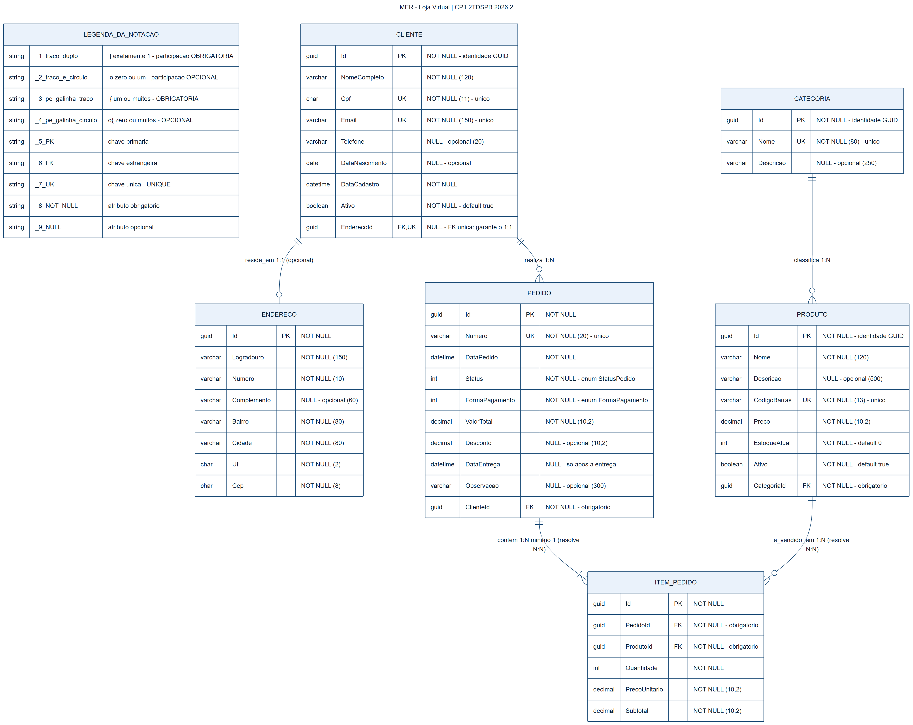

# CP1 — 2TDSPB 2026.2 · MER e Projeto WebAPI

MER de uma **Loja Virtual** e a estrutura inicial de uma **WebAPI .NET 9** organizada em
**Clean Architecture**, com as entidades do MER modeladas em C#.

> Conforme o enunciado, esta entrega **não tem** CRUD, controllers, endpoints, EF Core,
> migrations nem banco de dados.

## Integrantes

| Nome | RM |
|---|---|
| Murilo Marques Cabral | 568224 |
| Paulo Henrique Da Silva Kian | 563343 |
| Matheus Carneiro Maciel | 567753 |

## Domínio escolhido: Loja Virtual

Uma loja que vende produtos pela internet. O **cliente** se cadastra e pode informar um
**endereço** de entrega; os **produtos** são organizados em **categorias**; o cliente fecha um
**pedido**, cujos **itens** registram quais produtos foram comprados, em que quantidade e por
qual preço.

Escolhemos esse domínio porque ele gera naturalmente os três tipos de cardinalidade pedidos
(1:1, 1:N e N:N) e tem opcionalidade real: um cliente pode se cadastrar sem endereço, mas um
pedido nunca existe sem cliente.

## Diagrama MER

[](docs/mer.png)

Clique para abrir em tamanho real. A legenda da notação está no próprio diagrama, no quadro
`LEGENDA_DA_NOTACAO`. O código-fonte do diagrama é o [`docs/mer.mmd`](docs/mer.mmd).

| Símbolo | Significado |
|---|---|
| `——||` | exatamente **1** (obrigatório) |
| `——o|` | **0 ou 1** (opcional) |
| `——|{` | **1 ou muitos** (obrigatório) |
| `——o{` | **0 ou muitos** (opcional) |
| **PK** / **FK** / **UK** | chave primária / estrangeira / única |

O tipo e a obrigatoriedade (`NOT NULL` / `NULL`) de **cada atributo** estão escritos no próprio
diagrama.

## Entidades modeladas (6)

Implementadas em [`src/Projeto.Domain/Entities/`](src/Projeto.Domain/Entities/).

| Entidade | Papel no domínio | PK |
|---|---|---|
| **Cliente** | Quem compra na loja | `Guid` |
| **Endereco** | Endereço de entrega do cliente | `Guid` |
| **Categoria** | Agrupamento de produtos | `Guid` |
| **Produto** | Item disponível para venda | `Guid` |
| **Pedido** | Compra fechada por um cliente | `Guid` |
| **ItemPedido** | Produto dentro de um pedido (*entidade associativa*) | `Guid` |

Dois campos de estado são **enums** em
[`src/Projeto.Domain/Enums/`](src/Projeto.Domain/Enums/): `StatusPedido` e `FormaPagamento`.

### Estratégia de identificação (PK)

Todas as seis entidades usam **`Guid`** como chave primária, e as chaves estrangeiras seguem o
mesmo tipo. Adotamos uma única estratégia para o modelo inteiro por dois motivos:

- **Consistência** — não é preciso lembrar qual tabela usa qual tipo de Id.
- O Guid **não expõe informação de negócio**: um Id sequencial revelaria na URL quantos
  clientes ou pedidos a loja tem.

O trade-off é que o Guid ocupa 16 bytes contra 4 do `int`, deixando os índices maiores — custo
irrelevante numa loja deste porte.

## Resumo dos relacionamentos

São **5 relacionamentos**: um 1:1 e quatro 1:N — e as duas últimas linhas 1:N são justamente
as que resolvem o N:N.

### 1:1 — Cliente ⟷ Endereco (opcional)

Um cliente tem **0 ou 1** endereço; um endereço pertence a **exatamente 1** cliente.

A FK `Cliente.EnderecoId` é **nullable**, o que torna o relacionamento **opcional**, e
**UNIQUE**, o que impede dois clientes de apontarem para o mesmo endereço — sem o UNIQUE o
1:1 viraria 1:N.

### 1:N — quatro ocorrências

| Lado 1 | Lado N | Cardinalidade e opcionalidade |
|---|---|---|
| Cliente | Pedido | Cliente tem **0 ou muitos** pedidos; pedido tem **exatamente 1** cliente (`ClienteId` NOT NULL) |
| Categoria | Produto | Categoria tem **0 ou muitos** produtos; produto tem **exatamente 1** categoria (`CategoriaId` NOT NULL) |
| Pedido | ItemPedido | Pedido tem **1 ou muitos** itens — obrigatório, pedido vazio não existe |
| Produto | ItemPedido | Produto aparece em **0 ou muitos** itens — produto novo, nunca vendido, tem zero |

### N:N — Pedido × Produto, via `ItemPedido`

Um pedido contém muitos produtos e um produto aparece em muitos pedidos. Esse N:N não existe
fisicamente: ele é **decomposto nas duas últimas linhas 1:N** da tabela acima, ligadas à
entidade associativa `ItemPedido`.

`ItemPedido` guarda os atributos que pertencem à relação, e não ao produto:
`Quantidade`, `PrecoUnitario` e `Subtotal`. O `PrecoUnitario` é copiado de `Produto.Preco` no
momento da venda de propósito — se o preço mudar depois, o histórico do pedido não muda.

## Estrutura do projeto (Clean Architecture)

```
cp1-2tdspb/
├─ Projeto.sln
├─ docs/
│  ├─ mer.png
│  └─ mer.mmd
└─ src/
   ├─ Projeto.Domain/           # entidades e enums (nao referencia ninguem)
   ├─ Projeto.Application/      # contratos      -> depende do Domain
   ├─ Projeto.Infrastructure/   # implementacoes -> depende do Application
   └─ Projeto.Api/              # WebAPI (host)  -> depende do Infrastructure
```

Regra de dependência:

```
Projeto.Api -> Projeto.Infrastructure -> Projeto.Application -> Projeto.Domain
```

O **Domain** é o centro: não referencia nenhum projeto nem pacote externo, e as entidades são
classes C# puras. Todas as dependências apontam para dentro, que é a regra da Clean
Architecture.

As camadas `Application` e `Infrastructure` estão praticamente vazias porque o enunciado pede
"apenas a solução configurada e as entidades modeladas no código" e proíbe persistência.

## Como compilar

Requisito: **.NET SDK 9.0**.

```bash
dotnet build
dotnet run --project src/Projeto.Api
```

A API sobe sem expor nenhuma rota — é o esperado, já que o enunciado proíbe endpoints.
